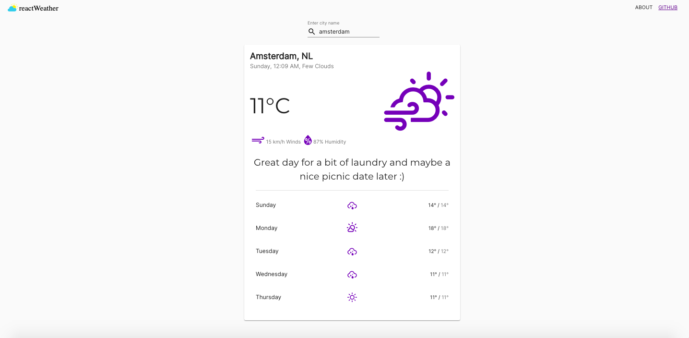

# Simple React Weather App  || [Demo](https://cocky-spence-83ab68.netlify.app/)

This project was created following code along exercise .
The basic idea of the project is to displays weather information from the OpenWeatherMap API.

